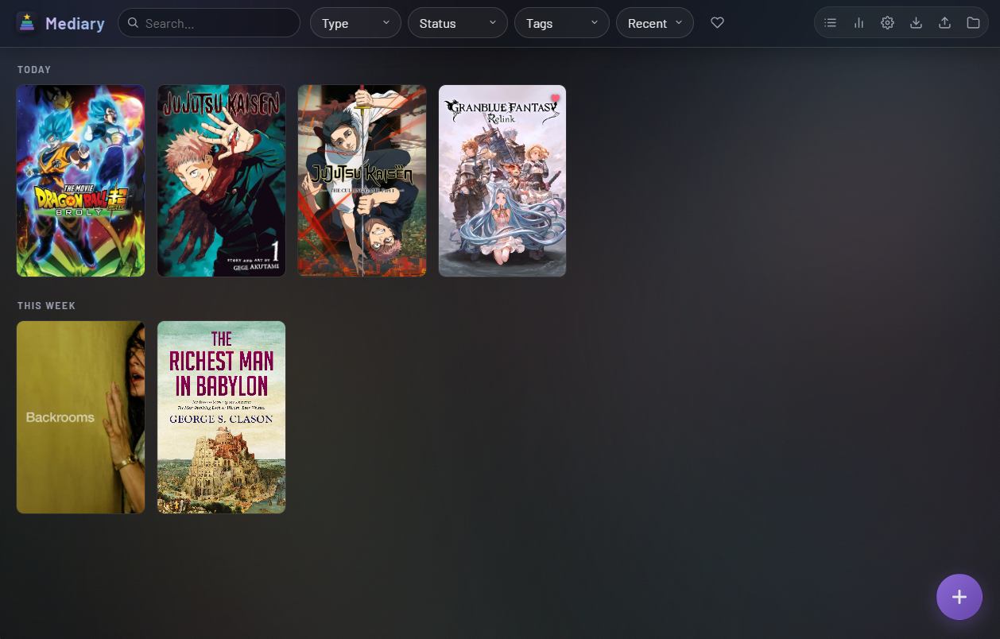
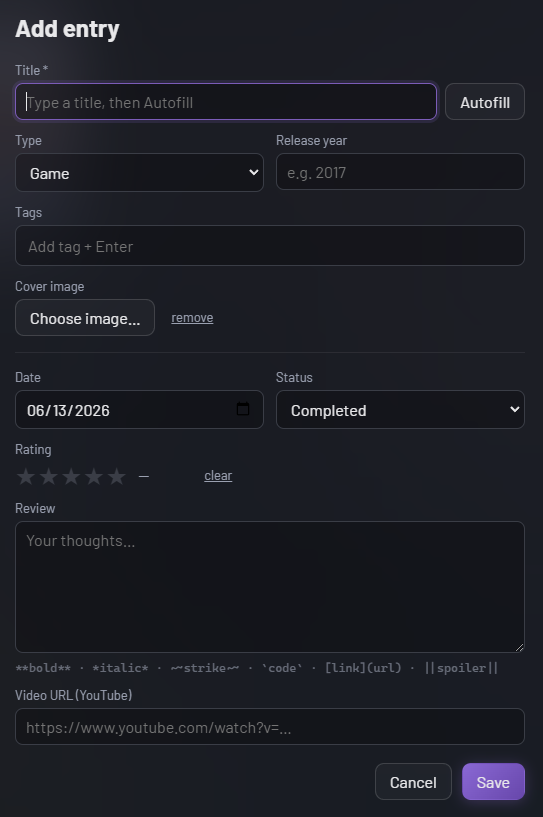
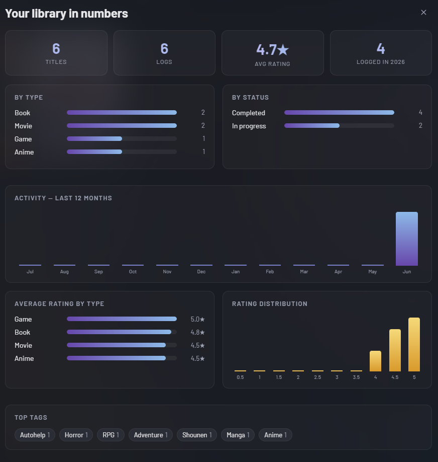

# Mediary

A personal media diary (a personal Backloggd) — log games, movies, TV,
anime, books and music with ratings, reviews, cover images and video links.
A local-first desktop app built with Electron and plain HTML/CSS/JS; your
data stays on your machine in a single JSON file.

## Features

- **Log anything** — games, movies, TV, anime, books, music, with a release
  year, cover image, and an optional embedded YouTube video
- **Multiple logs per title** — record every replay/rewatch separately
- **Half-star ratings, statuses** (completed / in progress / dropped / backlog
  / wishlist) and **Markdown reviews** with `||spoiler||` support
- **Metadata autofill** — fetch cover, year and genres from TMDB (movies/TV),
  IGDB (games), Open Library (books) and iTunes (music)
- **Tags, favorites, and ordered lists** (drag to reorder)
- **Search, filter and sort**; a **stats dashboard**; **export / import**
- **Automatic local backups** on every launch
- A glass, Steam-style library UI

## Screenshots

<!-- Drop PNGs in docs/ and they'll show here. -->




## Running

```
npm install
npm start
```

## Building a Windows .exe

```
npm install --save-dev electron-builder
npm run dist
```

The portable executable lands in `dist/`.

## Where your data lives

Everything is stored in `%APPDATA%\Mediary\library\` (data from the old
MediaLog name is migrated there automatically on first launch):

- `library.json` — all media items and logs
- `images\` — cover images, copied in when you pick them

The **Data folder** button in the app opens this folder. Back it up by copying
it anywhere; **Export** saves a standalone JSON snapshot.

On every launch the app also snapshots `library.json` into `library\backups\`,
keeping the 10 most recent. If a library ever gets corrupted or you make a
change you regret, copy a backup back over `library.json`.

**Import** merges another export back in: new titles and logs are added, and
anything already present (matched by id) is skipped — it never deletes or
overwrites, so importing is always safe. Exports carry no image files, so an
imported entry whose cover isn't present locally falls back to a placeholder.

## Architecture (and why)

```
main.js      — Electron main process. Owns ALL data access (the storage layer).
preload.js   — the bridge: the small, explicit API the UI is allowed to call.
renderer/    — the UI: plain HTML/CSS/JS, no framework.
build/       — icon source (icon.svg) and generated icon.ico.
tools/       — make-icons.js regenerates the icons from the SVG.
```

Design decisions made with the future public version in mind:

- **Media and logs are separate.** A `media` item (the game/movie itself) can
  have many `logs` (each playthrough/rewatch). This is how rewatches work, and
  later it lets media become shared/canonical while logs become per-user.
- **UUIDs everywhere** — entries can be merged into a shared database later
  without ID collisions.
- **Ratings are stored as integers 0–10** (half-stars), displayed as 0–5 stars.
- **All storage goes through `main.js`.** Migrating JSON → SQLite → a server
  database means changing one file; the UI doesn't care.
- **Images are files on disk** (UUID names), never blobs in the database.
  Videos are stored as URLs and embedded, never downloaded.

## Data shape

```json
{
  "version": 1,
  "media": [
    { "id": "uuid", "title": "Outer Wilds", "type": "game",
      "releaseYear": 2019, "coverImage": "uuid.jpg",
      "tags": ["Adventure", "Indie"] }
  ],
  "logs": [
    { "id": "uuid", "mediaId": "uuid", "dateConsumed": "2026-06-10",
      "status": "completed", "rating": 9, "review": "…",
      "videoUrl": null, "createdAt": "…", "updatedAt": "…" }
  ],
  "lists": [
    { "id": "uuid", "name": "Top 10 of 2026", "description": "",
      "items": ["media-uuid", "media-uuid"],
      "createdAt": "…", "updatedAt": "…" }
  ]
}
```

`status` is one of: `completed`, `in-progress`, `dropped`, `backlog`, `wishlist`.

**Lists** are ordered collections of media (the `items` array holds media ids
in display order). Manage them from the Lists button in the header; add an
entry to a list from its detail view; while viewing a list, drag covers to
reorder. Deleting a media item removes it from every list automatically.

Reviews support lightweight inline Markdown: `**bold**`, `*italic*`,
`~~strike~~`, `` `code` ``, `[link](url)` (http/https/mailto only), and
`||spoiler||` (blurred until clicked). Rendering escapes all HTML first, so
stored reviews can never inject markup.

## Metadata autofill

Type a title in the Add entry dialog and click **Autofill** (or press Enter):
the app searches the right database for the entry's type and fills in the
title, year and cover art with one click.

| Type | Source | Needs a key? |
| --- | --- | --- |
| Books | Open Library | No |
| Music | iTunes Search | No |
| Movies / TV / Anime | TMDB | Free key: themoviedb.org → account Settings → API |
| Games | IGDB | Free app at dev.twitch.tv/console/apps (Client ID + Secret) |

Keys are entered via the gear icon in the app and stored locally in
`%APPDATA%\Mediary\settings.json`.

## Roadmap

- **Done** — autofill, tags, favorites, ordered lists, Markdown reviews, stats
  dashboard, export/import, auto-backup, glass UI
- **Maybe next** — keyboard shortcuts, progress tracking for in-progress items,
  accent theming, swap JSON for SQLite if a library gets large
- **Someday (public)** — move the storage layer behind a real server
  (Postgres) with accounts; the media table becomes shared/canonical and logs
  get a `userId`. The app is already architected for this — all data access
  lives in `main.js`.

## License

[MIT](LICENSE) © Gabriel Vieira
